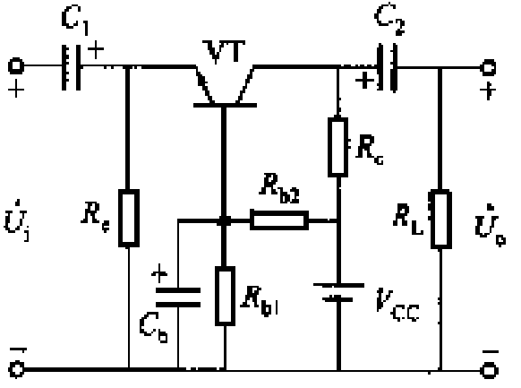
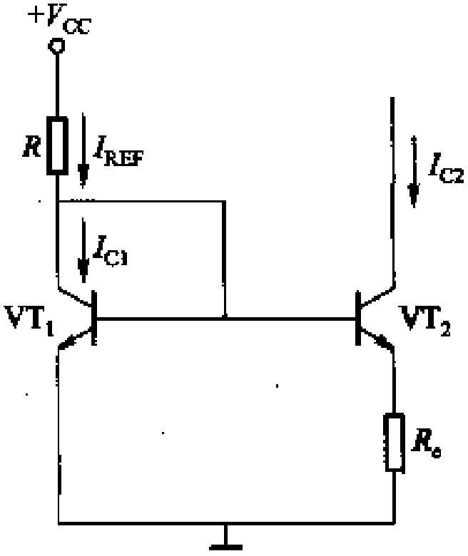
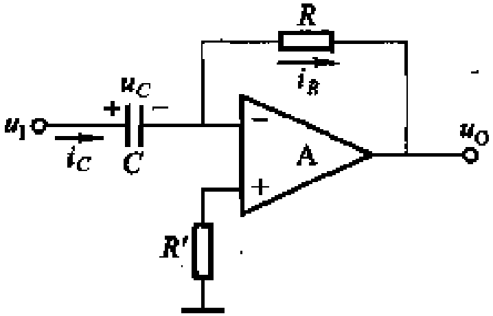

# 模拟电路复习手稿

## 半导体器件

### 半导体

- 多子的浓度取决于掺入杂质的浓度
- 少子的浓度取决于温度

### 二极管

- 二极管的两个模型：理想模型和恒压降模型
- 硅管和锗管的导通压降：0.7 V 和 0.2 V
- 了解一下稳压管怎么回事

### 三极管

直流分量 $I_{B}$，交流分量 $i_{b}$，瞬时值 $i_{B}$，交流有效值 $I_{b}$，交流值的相量

- 两条曲线：$i_{\text{B}} = \left.f\left(u_{\text{BE}}\right)\right|_{u_{\text{CE}} = \text{const}}$，$i_{\text{C}} = \left.f\left(u_{\text{CE}}\right)\right|_{i_{\text{B}} = \text{const}}$
- 三个区：截止区（都反偏），放大区（BE 正偏、BC 反偏），饱和区（都正偏）
  - 假设放大区，先算 $I_{\text{B}}$，再算 $I_{\text{C}} = \beta I_{\text{B}}$，看看 BC 是否反偏
  - 假设饱和区，$U_{\text{BE}} = 0.7 \mathrm{V}, U_{\text{CES}} = 0.3 \mathrm{V}$，看看是否有 $\beta I_{\text{B}} > I_{\text{CS}}$

- 三极管有个安全工作区，电流不能太大，电压不能太大，功率也不能太大（$i_{\text{C}} - u_{\text{CE}}$ 图上是一条反比例线）

## 放大电路的基本原理和分析方法

- PNP 三极管的微变等效电路：电阻和受控电流源的位置与 NPN 的相同，三个电流的方向取反

### 主要技术指标

- 放大倍数
- 输入电阻：从输入端看进去的电阻，越大越好
- 输出电阻：从负载 $R_{\text{L}}$ 看进去的电阻，越小越好
- 通频带：$\frac{\sqrt{2}}{2}$

### 单管放大电路三种组态

- 学会画直流通路和交流通路
- 学会画微变等效电路：be 之间连 $r_{\text{be}}$，ce 之间连电流源 $i_{\text{c}} = \beta i_{\text{b}}$
- 求静态工作点 $\to$ $r_{\text{be}}$ $\to$ 微变等效电路 $\to$ 放大系数、输入电阻、输出电阻（$u_{i} = 0$）
  - $r_{\text{be}} = r_{\text{bb}'}(= 300 \Omega) + (1 + \beta) \frac{26 \text{mV}}{I_{\text{EQ}}}$

#### 共射

- 交直流并存、电压放大、倒相
- 在 $i_{\text{C}} = \left.f\left(u_{\text{CE}}\right)\right|_{i_{\text{B}} = \text{const}}$ 中，负载线过低 $\to$ $u_{\text{CE}}$ 顶部截止失真（下边事截止区）
- 在 $i_{\text{C}} = \left.f\left(u_{\text{CE}}\right)\right|_{i_{\text{B}} = \text{const}}$ 中，负载线过高 $\to$ $u_{\text{CE}}$ 底部饱和失真（左边事饱和区）

#### 共集（射极输出器）

- 电压不放大、电流放大
- 输入电阻大、输出电阻小
- 作为输入级可减小对输入信号源的影响，作为输出级可提高负载能力，作为中间级隔离前后级的影响

#### 共基

- 输入电阻小，输出电阻大
- 放宽频带

### 静态工作点的稳定问题

温度升高，静态工作点上移，可能导致饱和失真

### 多级

1. 阻容耦合
    - 各级静态工作点独立
    - 不易放大低频信号，无法集成
2. 变压器耦合
    - 有阻抗变换的作用，各级静态工作点独立
    - 不易放大低频信号，无法集成
3. 直接耦合
    - 可放大直流和交流信号，便于集成
    - 各级静态工作点不独立，零点漂移严重

#### 抑制零点漂移

- 引入直流负反馈以稳定静态工作点
- 热敏元件
- 差分放大电路

#### 分析方法（两级）

将第二级的电阻看作第一级的负载电阻，$R_{\text{i2}}$ $\to$ $A_{\text{u1}}$ $\to$ $A_{\text{u2}}$ $\to$ $R_{\text{i}}$ $\to$ $R_{\text{o}}$

## 放大电路的频率响应

几个概念：$A_{\text{um}}, f_{\text{L}}, f_{\text{H}}, BW = f_{\text{H}} - f_{\text{L}}$

### 三极管

高频时，$\dot{\beta} = \frac{\beta_0}{1 + \mathrm{j} \frac{f}{f_{\beta}}}, \dot{\alpha} = \frac{\alpha_0}{1 + \mathrm{j} \frac{f}{f_{\alpha}}}$

- 共射截止频率：$f_{\beta}$
- 特征频率：$f_{\text{T}} = \beta_0 f_{\beta}$
- 共基截止频率：$f_{\alpha} = (1 + \beta_0) f_{\beta}$

### （共射的）两种耦合方式

阻容耦合：$\dot{A}_{\text{us}} \approx \frac{\dot{A}_{\text{usm}}}{(1 - \mathrm{j} \frac{f_{\text{L}}}{f}) (1 + \mathrm{j} \frac{f}{f_{\text{H}}})}$

直接耦合：$\dot{A}_{\text{us}}  =\frac{\dot{A}_{\text{usm}}}{1 + \mathrm{j} \frac{f}{f_{\text{H}}}}$

## 功率放大电路（功放）

前面的放大电路与功放的不同：

- 电路的要求：比较大的电压放大倍数 vs 足够的输出功率，较高的效率
- 主要技术指标：电压放大倍数、输入电阻、输出电阻 vs 最大输出功率、效率
- 分析方法：图解法、微变等效电路 vs 图解法

分类：

- 电路结构
    - OTL 互补对称功放
    - OCL 互补对称功放
- 功率三极管导电角（一个周期内多大的范围导通）
    - 甲类：$360 ^{\circ}$，波形好、管耗大效率低
    - 乙类：$180 ^{\circ}$，波形严重失真、管耗小效率高
    - 甲乙类：$180 ^{\circ} \sim 360 ^{\circ}$，居中

### 射极输出器

- 输出电阻小，带负载能力强
- 对负向输入电压的跟随范围小
- 效率低，若试图降低 Q 点，会引起截止失真

### 互补对称式功率放大电路

#### OTL 和 OCL

- OTL 乙类：$i_{\text{L}}$ **交越失真**
- OTL 甲乙类
    - 两种 OTL 在静态时 $U_{C} = V_{\text{CC}} / 2$

- OCL 甲乙类（省去了大电容，改善了低频响应，有利于实现集成化）
    - 静态时，$I_{\text{L}} = 0$
    - 调节 $R_1, R_2$ 做到 $U_{\text{O}} = 0$
    - 出现交越失真则增大 $R$
    - $R$ 开路或 $D_1, D_2$ 中有接反或开路，则三极管会烧毁；计算：$2 V_{\text{CC}} = I_{\text{B}} (R_1 + R_2) + 2 U_{\text{BEQ}}, P = V_{\text{CC}} \times I_{C}$

#### 极限参数

以 OCL 为例，对于 OTL，做代换 $V_{\text{cc}} \to \frac{V_{\text{cc}}}{2}$ 即可。

1. 最大输出功率 $U_{\text{cem}} = V_{\text{CC}} - U_{\text{CES}}$，$I_{\text{cm}} = \frac{U_{\text{cem}}}{R_{\text{L}}}$，$P_{\text{om}} = \frac{1}{2} U_{\text{cem}} I_{\text{cm}}$
2. 效率 $P_{\text{V}} = \frac{2}{\pi} V_{\text{CC}} I_{\text{cm}}$，$\eta = \frac{P_{\text{om}}}{P_{\text{V}}}$
3. 功率三极管
   1. 集电极最大允许电流 $I_{\text{CM}} > \frac{V_{\text{CC}} - U_{\text{CES}}}{R_{\text{L}}}$
   2. 集电极最大允许反向电压 $U_{\text{(BR)CEO}} > 2 V_{\text{CC}} - \left|U_{\text{CES}2}\right|$
   3. 集电极最大允许耗散功率 $P_{\text{CM}} > \frac{V_{\text{CC}}^2}{\pi^2 R_{\text{L}}}$
4. 欲得最大功率所需输入的电压有效值 $U_{\text{i}} = \frac{U_{\text{cem}}}{\sqrt{2}}$

### 复合管

- 保证电流方向合理
- 前面那个管的类型就是所得复合管的类型
- 两个相同类型的管：$\beta = \beta_1 \beta_2$，$r_{\text{be}} = r_{\text{be1}} + (1 + \beta_1) r_{\text{be2}}$
- 两个不同类型的管：$\beta = \beta_1 \beta_2$，$r_{\text{be}} = r_{\text{be1}}$

## 集成运算放大电路（集成运放）

四个部分：偏置电路（为各放大级提供偏置电流） $\to$ 差分放大输入（克服零点漂移） $\to$ 中间级（电压放大） $\to$ 输出级（功率放大）

### 偏置电路

- 镜像电流源：$I_{\text{B}1} = I_{\text{B}2}$
- 比例电流源：$U_{\text{B}1} = U_{\text{B}2}, U_{\text{BE}1} = U_{\text{BE}2}$
- 微电流源：$R_{\text{e}2} = \frac{26 \text{mV}}{I_{\text{C}2}} \ln \frac{I_{\text{C}1}}{I_{\text{C}2}}$

### 差分放大输入

还是要进行静态分析和动态分析！

- 牺牲一个放大管的放大倍数换取对零点漂移的抑制（但不理想），单端输出时失去对零点漂移的抑制能力
- 差模输入：$u_{\text{Id}} = \left| u_{+} - u_{-} \right|$，共模输入：$u_{\text{Ic}} = \left( u_{+} + u_{-} \right) / 2$
- 差模电压放大倍数：$A_{\text{d}} = \frac{\Delta u_{\text{O}}}{\Delta u_{\text{Id}}}$，共模电压放大倍数：$A_{\text{d}} = \frac{\Delta u_{\text{O}}}{\Delta u_{\text{Ic}}}$
- 共模抑制比：$K_{\text{CMR}} = 20 \lg \left| \frac{A_{\text{d}}}{A_{\text{c}}} \right| = 20 \lg \left| \frac{\Delta u_{\text{Ic}}}{\Delta u_{\text{Id}}} \right|$
- 根据对称性，分析微变等效电路的时候只需要分析半个电路，但是注意输入电阻、输出电阻需要 $\times 2$

#### 基本形式差分放大电路

- $A_{\text{d}} = A_{\text{u}1}$
- $A_{\text{c}} = 0$

#### 长尾式差分放大电路

- 静态分析注意两个交流源接地

#### 恒流源式差分放大电路

- 交流通路与长尾式的相同

把双入双出作为标准，

- 单入啥也不影响
- 单出，差模电压放大倍数 和 输出电阻 变为一半

### 中间级

目标：大的电压放大倍数、输入电阻、输出电流

1. 用（镜像）电流源替代共射的 $R_{\text{C}}$ $\to$ 大的电压放大倍数
2. 复合管代替单管 $\to$ 大的电压放大倍数、输入电阻
3. 差放替代单管，单端输出

### 输出级

目标：大的输出功率、输入电阻，小的输出电阻；不要求大的电压放大倍数，应减小失真，应有过载保护

1. 互补对称电路：甲乙类 OCL 或 OTL 互补对称电路
2. 过载保护电路

## 放大电路中的反馈

### 反馈的判断

- 什么事“输入信号”：集成运放的两个输入端点
- 什么事“集成运放”：就是上一章中的东西，常见的有：理想运放（三角形）的正负端点，三极管的 B 和 E，差放的两个输入

所谓的瞬时极性法需要记住：

1. 三极管 B 进，BE 同号，BC 反号；C 进，CE 同号；
2. 理想运放 + 出同号，- 出反号；
3. 差放的两个 C 反号（跷跷板……）。

怎么判断正反馈还是负反馈？

- i 和 f 在同端同号或异端异号，则为正反馈；

怎么判断电压反馈还是电流反馈？

- 将 $U_{o}$ 置零，若反馈消失，则为电压反馈

怎么判断串联反馈还是并联反馈？

- 千万别去理解所谓的“以电压形式求和”和“以电流形式求和”……
- 反馈接到了输入端，就是并联反馈

有两个撅喵的概念叫做“虚短”和“虚断”，这是反馈概念的精髓，但请注意必须是深度负反馈。

有个愚蠢的概念叫做“虚地”，不要去理解它，这是一个冗余的概念！

### 四种组态关注的量

- 不要尝试去记住这些东西，而是去观察它们的名字和式子的形式

1. 电压串联负反馈：$\dot{A}_{\text{uu}} = \frac{\dot{U}_{\text{o}}}{\dot{U}\text{i}'}, \dot{F}_{\text{uu}} = \frac{\dot{U}_{\text{f}}}{\dot{U}_o}$
2. 电压并联负反馈：$\dot{A}_{\text{ui}} = \frac{\dot{U}_{\text{o}}}{\dot{I}\text{i}'}, \dot{F}_{\text{iu}} = \frac{\dot{I}_{\text{f}}}{\dot{U}_o}$
3. 电流串联负反馈：$\dot{A}_{\text{iu}} = \frac{\dot{I}_{\text{o}}}{\dot{U}\text{i}'}, \dot{F}_{\text{ui}} = \frac{\dot{U}_{\text{f}}}{\dot{I}_o}$
4. 电流并联负反馈：$\dot{A}_{\text{ii}} = \frac{\dot{I}_{\text{o}}}{\dot{I}\text{i}'}, \dot{F}_{\text{ii}} = \frac{\dot{I}_{\text{f}}}{\dot{I}_o}$

~~这个东西似乎没有什么用处，~~按说它们可以方便电压放大倍数的计算，但是实际上电压放大倍数总是可以利用虚短和虚断轻松得到

### 一般表达式

闭环放大倍数 $\dot{A}_{\text{f}} = \frac{\dot{A}}{1 + \dot{A} \dot{F}}$

### 对放大电路性能的影响

1. 放大倍数下降为原来的 $\frac{1}{1 + \dot{A} \dot{F}}$，放大倍数稳定性提高了 $\left(1 + \dot{A} \dot{F}\right)$
2. 减小放大电路的非线性失真、抑制干扰
3. 上限截止频率提高 $\left(1 + \dot{A} \dot{F}\right)$，下限截止频率变为原来的 $\frac{1}{1 + \dot{A} \dot{F}}$
4. 输入电阻：串联反馈增大、并联反馈减小（形象地理解，串联反馈从输入端来看像是一个放大电路和另一个东西串联）
5. 输出电阻：电压反馈减小，电流反馈增大（形象地理解，电压反馈从输输出端来看像是一个放大电路和另一个东西并联）
6. 非要说的话，直流负反馈稳定静态工作点
7. 最后是一句废话：电压负反馈稳定输出电压，电流负反馈稳定输出电流

### （深度负反馈）计算闭环电压放大倍数

别的都没用，你就记住：$U_{+} = U_{-}, I_{+} = I_{-} = 0$ 就完事了

### 负反馈的自激振荡

#### 条件

$\dot{A} \dot{F} = - 1$ 或 $\left| \dot{A} \dot{F} \right| = 1$ 且 $\arg \dot{A} \dot{F} = \pm (2 n + 1) \pi$，实际上是 $\left| \dot{A} \dot{F} \right| \geq 1$ 的时候也可以

幻灯片里是给你一个波特图问你能不能产生自激振荡。

## 运算电路（估计是这里会考电路的设计）

1. 反相比例：输入电阻小、输出电阻小
2. 同相比例：输入电阻大、输出电阻小
3. 差分比例：输入电阻小、输出电阻小
4. 反相输入求和
5. 同相输入求和
6. 积分电路：波形变换、移相（具体计算时注意电容两端电压可能饱和）
7. 微分电路

反相比例和同相比例中 $R_2 = R_1 // R_{\text{F}}$，差分比例中 $R_1 = R_{1'}, R_{\text{F}} = R_{\text{F}'}$

积分电路 $U_{\text{I}} / R + C \dv{U_{\text{O}}}{t} = 0$

## 信号处理电路

### 有源滤波器

1. 低通：RC 串联，从 C 输出
2. 高通：RC 串联，从 R 输出
3. 带通 = 低通 + 高通
4. 带阻 = 低通 + 高通

RC 串联，R 上是高通，C 上是低通。$f_{\text{T}} = \frac{1}{2 \pi R C}$

- 高通：$f < f_{\text{T}}$，$20 \text{dB}$/十倍频 达到零；$0.1 f_{\text{T}} < f < 10 f_{\text{T}},\ 90 ^{\circ}$ 开始 $- 45 ^{\circ}$/十倍频 达到 $0 ^{\circ}$
- 低通：$f > f_{\text{T}}$，零开始 $- 20 \text{dB}$/十倍频；$0.1 f_{\text{T}} < f < 10 f_{\text{T}},\ 0 ^{\circ}$ 开始 $- 45 ^{\circ}$/十倍频 达到 $- 90 ^{\circ}$

### 电压比较器

- 电压比较器工作在理想运放的非线性区

按照上交郑老师的说法，先分析临界点，再分析两边的情况。实际上，应该记住两边的趋势（看清楚是不是负端输入），然后直接看临界点（$U_{+} = U_{-}$）

1. 过零比较器（输入负输出正）、单限比较器（抗干扰能力差）
2. 滞回比较器：算临界点的时候不用纠结具体的过程，$\pm U_{\text{Z}}$ 各算一个就行了
3. 双限比较器：临界点就是两个参考电压

注意，为了避免混淆，电压比较器我只贴出了反向端输入的（除了双限比较器）。

## 波形发生电路

### 分析方法

#### 条件

- 起振：$\left| \dot{A} \dot{F} \right| > 1$ 且 $\varphi_{\text{A}} + \varphi_{\text{F}} = \pm 2 n \pi$
- 稳幅：$\left| \dot{A} \dot{F} \right| = 1$ 且 $\varphi_{\text{A}} + \varphi_{\text{F}} = \pm 2 n \pi$

#### 如何判断给定电路是否满足相位条件：瞬时极性法

断开反馈回路，加入输入信号 $\dot{U}_{\text{i}}$，~~分析此时 $\dot{U}_{\text{i}}$ 和 $\dot{U}_{\text{f}}$ 的相位关系~~，若输入的和反馈回来的同极性则满足相位条件

- 注意，$\varphi_{\text{A}}$ 只是放大电路的相位差，往往此时放大电路事一个理想运放，则$\varphi_{\text{A}} = 0 \text{ or } 180 ^{\circ}$
    - 如果是三极管，则通常是共基（E 输入，C 输出）或共射（B 输入、C 输出）
        - 判断是共基还是共射：反馈接到 E (B) 就是 共基（共射）
    - 先判断是否满足相位条件（$\varphi_{A} + \varphi_{F}$），再判断 $\varphi_{A}$，最后算 $\varphi_{F}$
    
- $\dot{U}_{\text{f}}$ 说的只是正反馈部分
- 这只是相位条件，判断完后不要得意忘形，还要判断幅值条件。你可能会说，我理想运放放大能力很强，幅值条件怎么会不满足？请注意，在深度负反馈情况下，放大电路的放大系数由负反馈系数决定
- 瞬时极性法里面一些电压关系的背后是电流，从这一点出发有时候很清楚

#### 电路组成

放大 $\to$ 选频 $\to$ 正反馈 $\to$ 稳幅

### RC 振荡（低频）

#### RC 串并联网络

- 事一个带通滤波器
- 从 RC 并联那里输出
- $\dot{F} = \frac{1}{3 + \mathrm{j} \left[\omega C R - \frac{1}{\omega C R}\right]}$ $\Rightarrow$ $\omega = \omega_0 \equiv \frac{1}{R C}$ 时 $\dot{F}_{\text{max}} = \frac{1}{3}$，$\varphi_{F} = 0$
- $- 90 ^{\circ} < \varphi_{\text{F}} < 90 ^{\circ}$

#### 文氏电桥

- RC 串并联网络正反馈 从 + 输入端输入，作用：选频
- 电阻串联负反馈 从 - 输入端输入，作用：改善振荡波形、减小放大电路对选频特性的影响、提高振荡电路的带负载能力
- $f_{0} = \frac{1}{2 \pi R C}$
- 起振 $\left| \dot{A} \dot{F} \right| > 1 \Rightarrow R_{\text{F}} > 2 R'$（也就是说反馈电阻、离地远的那个电阻更大！）

$(R_1 = R_2, C_1 = C_2)$

#### RC 移相式振荡电路

- 一节 RC 电路的移相范围事 $0 \sim 90 ^{\circ}$

### LC 振荡（高频）

#### LC 并联电路

- $f_{0} = \frac{1}{2 \pi \sqrt{L C}}$，想清楚谁是 $L$，谁是 $C$，因为可能存在电感的串并联、电容的串并联、互感
- $Q = \frac{\omega_0 L}{R}$

1. 变压器反馈式
2. 电感三点式
3. 电容三点式

- 可能是：$f = \frac{1}{2 \pi \sqrt{(L_1 + L_2 + 2 M) C}}, f = \frac{1}{2 \pi \sqrt{L \frac{C_1 C_2}{C_1 + C_2}}}, f = \frac{1}{2 \pi \sqrt{L C_3}}$

## 直流电源

四个部分：变压（幅值变小） $\to$ 整流（有正有负变为全正） $\to$ 滤波（过滤脉动值、提高平均值） $\to$ 稳压（使得负载变化时电压保持稳定）

### 单相整流

直接利用二极管的单向导电性整流。

1. 单相半波整流电路：一个二极管
2. 单相全波整流电路：两个二极管
3. 单相桥式整流电路：四个二极管

|      | 输出直流电压 $U_{\text{O(AV)}}$ | 脉动系数 $S = \frac{U_{\text{O1m}}}{U_{\text{O(AV)}}}$ | 二极管正向平均电流 $I_{\text{D(AV)}}$ | 二极管最大反向峰值电压 $U_{\text{RM}}$ |
| ---- | ------------------------------- | ------------------------------------------------------ | ------------------------------------- | -------------------------------------- |
| 半波 | $0.45 U_{2}$                    | $1.57$                                                 | $I_0$                                 | $\sqrt{2} U_{2}$                       |
| 桥式 | $0.9 U_{2}$                     | $0.67$                                                 | $I_0 / 2$                             | $\sqrt{2} U_{2}$                       |

> 缺单相半波整流电路和单相全波整流电路的电路图

### 滤波

1. 电容滤波（负载并上电容）
   - 桥式整流时：$R_{\text{L}} C \geq ( 3 \sim 5 ) \frac{T}{2}, U_{\text{O(AV)}} \approx 1.2 U_{2}$
   - 小电流负载
   - 整流二极管中将流过较大的冲击电流

|                                  | 负载开路（滤波时电压不下降） | 正常工作（整流 + 滤波） | 电容开路（仅整流） | 一个二极管开路 | 一个二极管开路 + 电容开路（半波整流） |
| -------------------------------- | ---------------------------- | ----------------------- | ------------------ | -------------- | ------------------------------------- |
| $\frac{U_{\text{O(AV)}}}{U_{2}}$ | $\sqrt{2}$                   | $1.2$                   | $0.9$              | $0.6 \sim 0.9$ | $0.45$                                |

2. 电感滤波（负载串上电感）
   - 直流流过电感没有损失，交流电源全部落在电感上
   - 大电流负载
   - 整流二极管冲击电流小
3. 复式滤波
   1. LC 滤波
   2. LC - $\Pi$ 型滤波：在桥式整流和 LC 滤波之间并一个电容
   3. RC - $\Pi$ 型滤波：LC - $\Pi$ 型滤波 的电感换成电阻

|                   | $U'_{\text{O(AV)}} / U_{2}$ | 使用场合   | 整流二极管冲击电流 | 外特性（?） |
| ----------------- | --------------------------- | ---------- | ------------------ | ----------- |
| 电容滤波          | 1.2                         | 小电流     | 大                 | 软          |
| 电感滤波          | 0.9                         | 大电流     | 小                 | 硬          |
| LC 滤波           | 0.9                         | 适应性较强 | 小                 | 硬          |
| LC - $\Pi$ 型滤波 | 1.2                         | 小电流     | 大                 | 软          |
| RC - $\Pi$ 型滤波 | 1.2                         | 小电流     | 大                 | 更软        |

如何记忆？记住前两列和前两行

